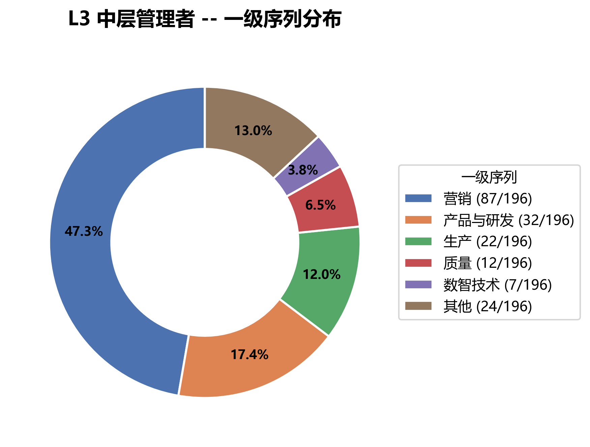
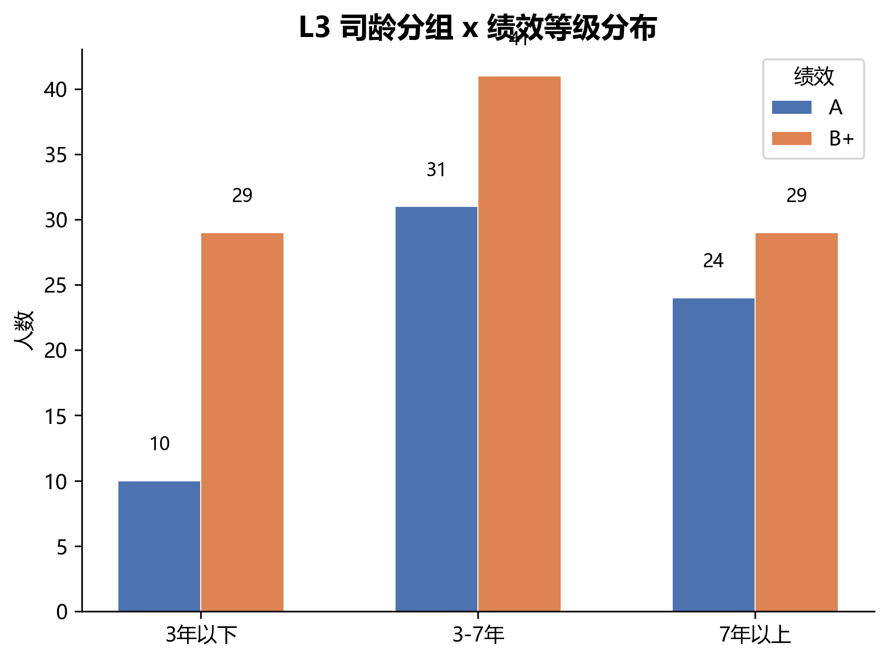
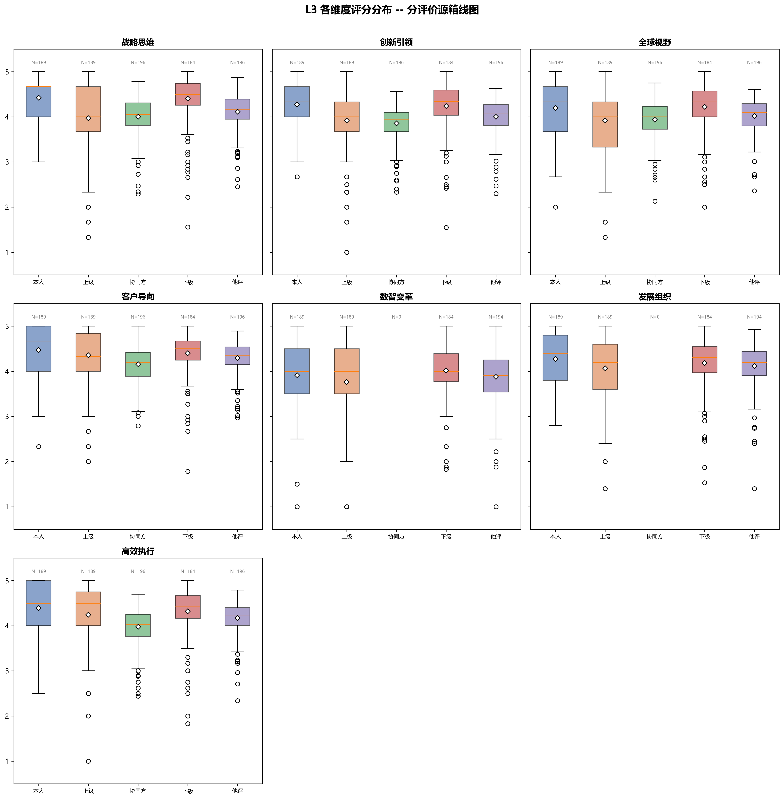
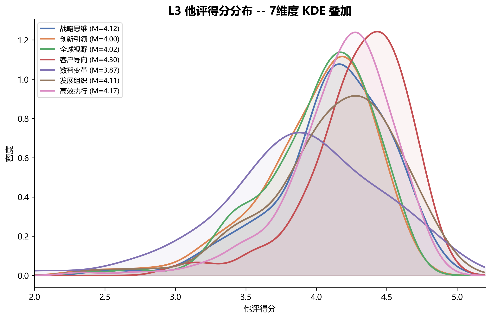
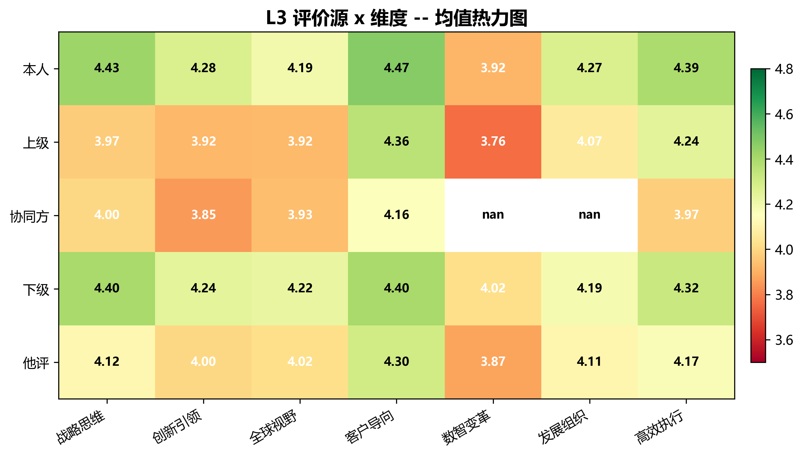
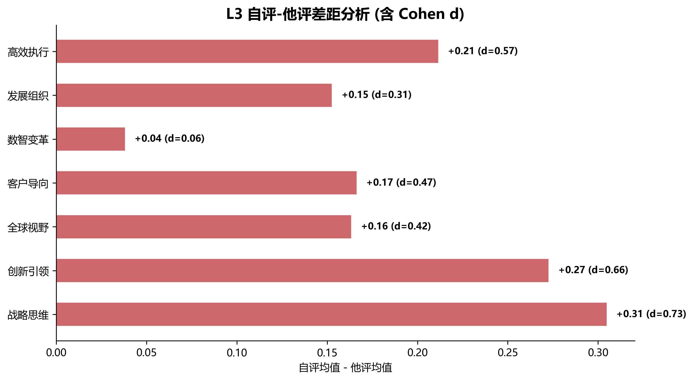
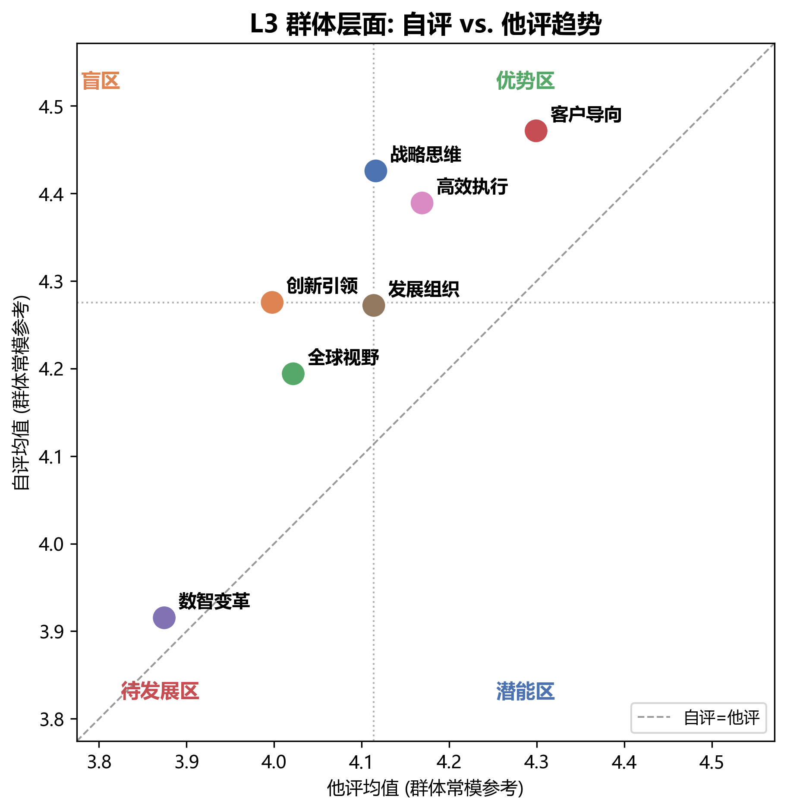
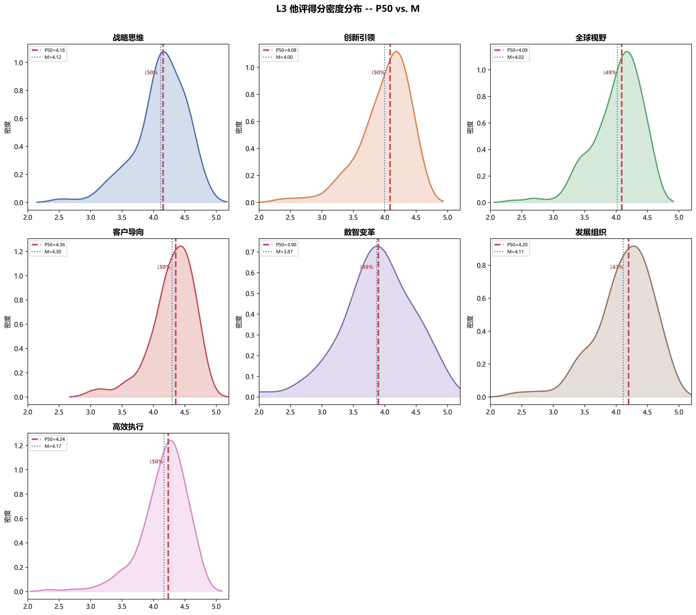
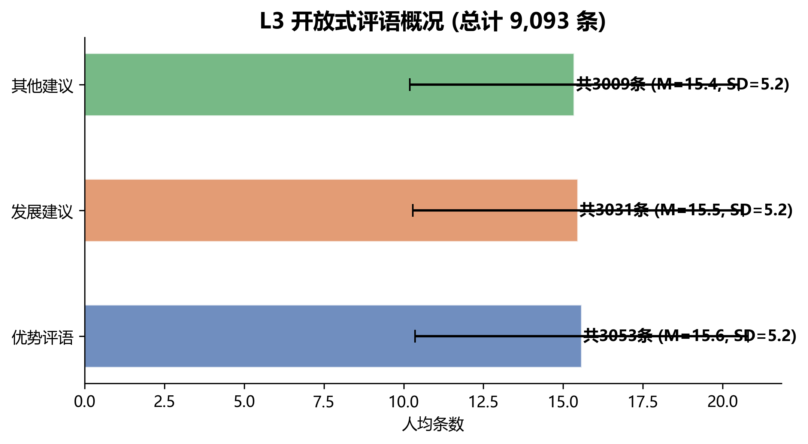

# L3 中层管理者 360反馈 数据分析报告

## 数据来源与样本概况

### 数据概要

| 指标 | 数值 |
|---|---|
| 样本量 | 196 名中层管理者 |
| 评价行数 | 3,286 条 |
| 评分量表 | Likert 5 点 (1-5) |
| 维度体系 | 7 个领导力要素 |
| 评价来源 | 本人、上级、协同方、下级 |
| 被评价人与L4关系 | 基本独立（仅2人交集） |

**数据文件:** `data/raw/leadership_feedback_level3_rev.csv` (3,286行)
**处理管线:** `01_transform_to_wide.py` -> 50字段宽表

### 人口学特征

**连续变量分布:**

| 变量 | M | SD | P25 | P50 | P75 | 范围 |
|---|---|---|---|---|---|---|
| 司龄(年) | 5.47 | 3.38 | 3.3 | 4.5 | 7.0 | 0.5-21.5 |
| 年龄(岁) | 37.60 | 5.29 | 34.0 | 37.0 | 41.0 | 28-59 |
| 直接下属人数 | 6.92 | 6.63 | 3.0 | 5.0 | 8.0 | 0-58 |

**一级序列分布：** 产品与研发 68人 (34.7%)、营销 50人 (25.5%)、生产 17人 (8.7%)、质量 15人 (7.7%)、采购 15人 (7.7%)——前5大序列合计占 84.2%。

**司龄分组：** 3年以下 46人 (23.5%)、3-7年 100人 (51.0%)、7年以上 50人 (25.5%)。

**绩效等级：** A 109人 (55.6%)、B+ 83人 (42.3%)，A/B+ 合计占 97.9%。

## 评分分布特征

### 总体分布

各评价源的评分均值集中在 4.0-4.6 之间，呈现显著的天花板效应。

| 评价源 | N(行) | M | SD | P5 | P25 | P50 | P75 | P95 |
|------|------|------|------|------|------|------|------|------|
| 本人 | 1,352 | 4.38 | 0.54 | 3.50 | 4.00 | 4.50 | 5.00 | 5.00 |
| 上级 | 1,340 | 4.09 | 0.69 | 3.00 | 3.50 | 4.00 | 4.50 | 5.00 |
| 协同方 | 972 | 4.20 | 0.32 | 3.70 | 4.00 | 4.22 | 4.43 | 4.63 |
| 下级 | 1,340 | 4.38 | 0.47 | 3.50 | 4.17 | 4.50 | 4.70 | 5.00 |
| 他评(综合) | 1,372 | 4.21 | 0.38 | 3.55 | 4.00 | 4.29 | 4.50 | 4.73 |

### 分维度 x 评价源箱线图

关键发现：数智变革是唯一均值低于4.0的维度（他评M=3.95）；客户导向最集中（SD=0.28）；上级评分离散度最大（SD=0.69——同一维度上级评分的跨个体差异最大）。

### 他评 KDE 叠加

所有维度峰值集中在4.0-4.5窄带内。数智变革分布最扁平，客户导向最尖锐。分布整体左偏，与L4模式高度一致。

### 评价源 x 维度热力图

自评普遍高于他评。数智变革在各评价源中均得分最低。协同方评分最为扁平（SD=0.32），跨维度区分能力有限。

## 自评-他评差距分析

### 差距概览

所有7个维度均为正向差距（自评>他评），差值+0.07~+0.21。

| 维度 | 自评 M | 他评 M | 差距 | Cohen d |
|---|---|---|---|---|
| 战略思维-科学决策 | 4.60 | 4.39 | +0.21 | 0.60 |
| 创新引领-持续精进 | 4.26 | 4.13 | +0.13 | 0.40 |
| 全球视野-管理复杂情况 | 4.30 | 4.21 | +0.09 | 0.26 |
| 客户导向-珍视客户 | 4.48 | 4.37 | +0.11 | 0.41 |
| 数智变革-加强数字应用 | 4.04 | 3.95 | +0.08 | 0.17 |
| 发展组织-带兵打仗 | 4.45 | 4.29 | +0.16 | 0.38 |
| 追求卓越-高效执行 | 4.49 | 4.31 | +0.18 | 0.56 |

战略思维-科学决策差距最大（+0.21, d=0.60）；数智变革差距最小（+0.08, d=0.17），且差距SD最大（0.68），个体分化严重。

### 群体层面趋势

所有7个点在对角线上方，确证整体正向偏差。趋势与L4几乎完全一致：战略思维和高效执行偏差最大，创新引领和全球视野偏差最小。

## 常模阈值分析

### 中位数阈值（推荐方案）

推荐以中位数（P50）作为乔哈里视窗四象限分界线。理由：
1. 分布适配性：各维度左偏，中位数更能反映群体典型水平
2. 切割均衡性：中位数天然将群体等分
3. 稳健性：小样本（196人）分组下比均值更稳定

| 维度 | 他评 M | 他评 P50 | M - P50 |
|---|---|---|---|
| 战略思维-科学决策 | 4.39 | 4.43 | -0.04 |
| 创新引领-持续精进 | 4.13 | 4.19 | -0.06 |
| 全球视野-管理复杂情况 | 4.21 | 4.26 | -0.05 |
| 客户导向-珍视客户 | 4.37 | 4.40 | -0.03 |
| 数智变革-加强数字应用 | 3.95 | 4.00 | -0.05 |
| 发展组织-带兵打仗 | 4.29 | 4.33 | -0.04 |
| 追求卓越-高效执行 | 4.31 | 4.35 | -0.04 |

M与P50的偏离在±0.06以内，各维度分布形态与L4高度相似。创新引领偏离最大（-0.06），左偏最明显。

### 乔哈里视窗映射规则（拟）

基于P50阈值的四象限判定（待阈值分析报告最终确认）：

| 象限 | 条件 | 含义 |
|---|---|---|
| 优势区 | 自评>=P50 且 他评>=P50 | 已被认可的优势 |
| 盲区 | 自评>=P50 且 他评<P50 | 自视过高 |
| 潜能区 | 自评<P50 且 他评>=P50 | 未意识到的潜力 |
| 待发展区 | 自评<P50 且 他评<P50 | 公认待发展领域 |

### 司龄分组常模（备选）

按司龄分组的他评P50在各维度上差异极小（<0.1分），建议个体报告默认使用全量常模。

## 开放式评语概况

| 评语类型 | 总条数 | 人均 M | SD |
|---|---|---|---|
| 优势评语 | 792 | 4.04 | 1.07 |
| 发展建议 | 678 | 3.46 | 1.39 |
| 其他建议 | 292 | 1.49 | 0.83 |

优势评语最多（人均4.04条），发展建议参与度较好（人均3.46条）。与L4相比，L3的人均评语条数略高（L4人均优势3.88条/发展3.29条）。

## 关键发现与建议

1. **天花板效应显著**：评分集中在4.0-4.6窄带内，与L4模式一致。上级评分区分度最高（SD=0.69），协同方评分区分度最低（SD=0.32）。

2. **自评偏差普遍存在**：7维度均为正向差距，战略思维偏差最突出（d=0.60），与L4一致。趋势几乎完全复现L4模式——说明自评-他评偏差是跨层级共性问题。

3. **数智变革是共识性短板**：所有评价源中得分最低（M=3.95），与L4（M=3.96）几乎完全相同。个体分化最明显（SD=0.51）。

4. **P50阈值与L4高度一致**：各维度他评P50在4.00-4.43之间，与L4几乎重合。自评P50同样集中在4.50+。这意味着L4的阈值方案（自评4.50/他评4.40）可能对L3同样适用。

5. **协同方评分信息有限**：跨维度评分高度扁平（SD=0.32），与L4（SD=0.34）一致。

6. **评分模式跨层级稳定**：L3与L4在分布形态、差距模式、阈值位置上的高度一致，说明领导力评估的评分行为不因层级不同而产生实质性偏移。

## 输出文件清单

| 文件 | 路径 |
|---|---|
| 分析报告 | `output/analysis_report_l3.md` |
| 常模统计JSON | `data/processed/norm_stats_l3.json` |
| P1 一级序列环状图 | `output/analysis_figures_l3/p1_sequence_donut.png` |
| P2 司龄-绩效柱状图 | `output/analysis_figures_l3/p2_tenure_performance.png` |
| D1 分面箱线图 | `output/analysis_figures_l3/d1_faceted_boxplot.png` |
| D2 KDE叠加图 | `output/analysis_figures_l3/d2_kde_other_ratings.png` |
| D3 热力图 | `output/analysis_figures_l3/d3_heatmap.png` |
| G1 差距条形图 | `output/analysis_figures_l3/g1_gap_bar.png` |
| G2 自评他评散点图 | `output/analysis_figures_l3/g2_self_other_scatter.png` |
| J1 密度+阈值图 | `output/analysis_figures_l3/j1_density_threshold.png` |
| C1 评语分布图 | `output/analysis_figures_l3/c1_comment_counts.png` |
