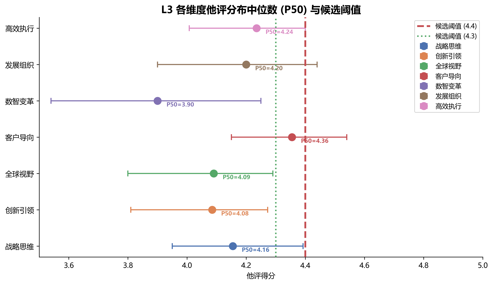
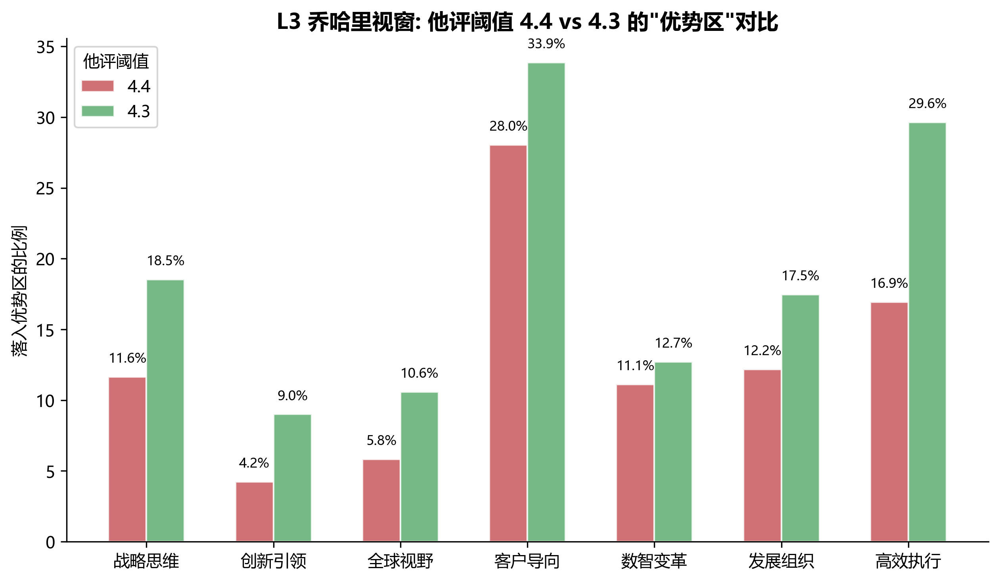
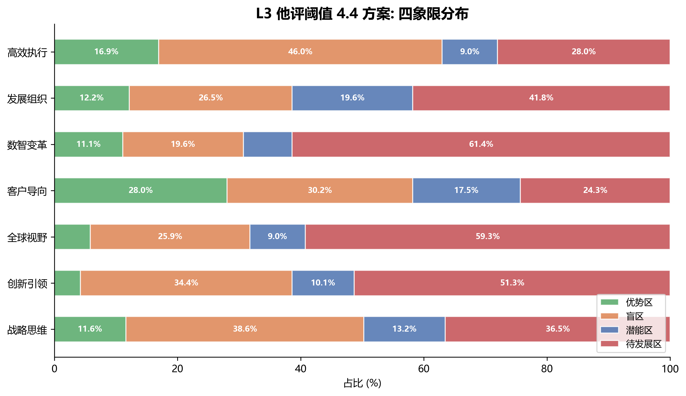

# L3 中层管理者 乔哈里视窗阈值选择分析报告

## 1. 背景与问题

乔哈里视窗可视化需要在单个散点图中绘入7个领导力维度的自评-他评分布，因此横轴（自评）和纵轴（他评）各需**一对统一的阈值**，而非每个维度各自一套。本报告为L3（中层管理者，196人）确定这一阈值对。

**坐标约定：**
- 横轴 X = 自评得分
- 纵轴 Y = 他评得分
- 四个象限的判定规则：
  - 优势区：自评>=阈值 AND 他评>=阈值
  - 盲区：  自评>=阈值 AND 他评<阈值
  - 潜能区： 自评<阈值 AND 他评>=阈值
  - 待发展区：自评<阈值 AND 他评<阈值


## 2. 自评阈值的确定

### 2.1 各维度自评P50

| 维度 | 自评 P50 |
|------|---------|
| 战略思维-科学决策 | 4.67 |
| 创新引领-持续精进 | 4.33 |
| 全球视野-管理复杂情况 | 4.33 |
| 客户导向-珍视客户 | 4.67 |
| 数智变革-加强数字应用 | 4.00 |
| 发展组织-带兵打仗 | 4.40 |
| 追求卓越-高效执行 | 4.50 |

### 2.2 确定过程

与L4不同，L3的自评P50在各维度上分散度更高（4.00-4.67），而非L4的集中在4.50以上。

- 3/7个维度P50 >= 4.50（战略思维、客户导向、高效执行）
- 2/7个维度P50在4.33（创新引领、全球视野）
- 1/7个维度P50在4.40（发展组织）
- 1/7个维度P50在4.00（数智变革）

考虑以下因素：**(a)** 全量自评的 pooled P50 ≈ 4.43（所有自评评分的全局中位数），取整到4.50后便于报告沟通；**(b)** 离散型Likert量表上5分制，4.50是自然的切割点（"符合期望"与"超出期望"的语义分界）；**(c)** 与L4保持一致可简化跨层级比较。

**自评阈值采用 4.50**，与L4保持一致。


## 3. 他评阈值的两方案

### 3.1 他评P50分布

他评P50的分布在3.90-4.36之间，跨度显著且系统性地低于L4（L4为4.00-4.43）：

| 维度 | 他评 P50 | 他评 P25 | 他评 P75 | 与L4同维度P50差异 |
|------|---------|---------|---------|-----------------|
| 战略思维-科学决策 | 4.16 | 3.95 | 4.39 | **-0.27** |
| 创新引领-持续精进 | 4.08 | 3.81 | 4.27 | -0.11 |
| 全球视野-管理复杂情况 | 4.09 | 3.80 | 4.29 | -0.17 |
| 客户导向-珍视客户 | 4.36 | 4.15 | 4.54 | -0.04 |
| 数智变革-加强数字应用 | 3.90 | 3.54 | 4.25 | -0.10 |
| 发展组织-带兵打仗 | 4.20 | 3.90 | 4.44 | -0.13 |
| 追求卓越-高效执行 | 4.24 | 4.01 | 4.40 | -0.11 |

**关键发现**：L3的他评评分系统性地低于L4，其中战略思维差异最大（-0.27），客户导向差异最小（-0.04）。这意味着L4使用的4.4阈值对L3来说可能过严。

### 3.2 候选阈值在分布中的位置

F3图展示了各维度他评P50与两个候选阈值的空间关系。



**关键观察：**
- **4.4** 高于所有维度的他评P50——在L3中，4.4是一个"高标准"，绝大多数人他评低于此线
- **4.3** 高于6/7个维度的P50，但更接近客户导向（4.36）的P50位置
- 数智变革（3.90）在两种方案下都远低于阈值，是共识性短板
- L3的他评P50整体左移（与L4相比），说明对中层管理者的他评标准更严格


## 4. 象限分布对比（4.4 vs 4.3）

基于196名L3中层管理者的实际配对评分数据，计算两个阈值下各维度的四象限分布：

### 4.4（严格方案）

| 维度 | 优势区 | 盲区 | 潜能区 | 待发展区 |
|------|--------|------|--------|---------|
| 战略思维 | 11.6% | 38.6% | 13.2% | 36.5% |
| 创新引领 | 4.2% | 34.4% | 10.1% | 51.3% |
| 全球视野 | 5.8% | 25.9% | 9.0% | 59.3% |
| 客户导向 | 28.0% | 30.2% | 17.5% | 24.3% |
| 数智变革 | 11.1% | 19.6% | 7.9% | 61.4% |
| 发展组织 | 12.2% | 26.5% | 19.6% | 41.8% |
| 高效执行 | 16.9% | 46.0% | 9.0% | 28.0% |
| **加权平均** | **13.0%** | **31.6%** | **12.3%** | **43.1%** |

### 4.3（温和方案）

| 维度 | 优势区 | 盲区 | 潜能区 | 待发展区 |
|------|--------|------|--------|---------|
| 战略思维 | 18.5% | 31.7% | 16.4% | 33.3% |
| 创新引领 | 9.0% | 29.6% | 14.3% | 47.1% |
| 全球视野 | 10.6% | 21.2% | 14.8% | 53.4% |
| 客户导向 | 33.9% | 24.3% | 22.2% | 19.6% |
| 数智变革 | 12.7% | 18.0% | 11.1% | 58.2% |
| 发展组织 | 17.5% | 21.2% | 23.3% | 38.1% |
| 高效执行 | 29.6% | 33.3% | 13.2% | 23.8% |
| **加权平均** | **19.0%** | **25.7%** | **16.6%** | **38.7%** |

F1图直观对比了两个方案下各维度落入"优势区"的比例差异：



F2图展示了4.4方案下各维度的完整四象限分布结构：




## 5. 维度级影响分析

| 维度 | 4.4%优势区 | 4.3%优势区 | 优势区变化 | 四类型变化解读 |
|------|----------|----------|----------|--------------|
| 战略思维 | 11.6% | 18.5% | +6.9pp | 盲区→潜能区的主流向，认知偏差信号仍强 |
| 创新引领 | 4.2% | 9.0% | +4.8pp | 仍属于共识偏弱维度，阈值降低后约4.8%脱出待发展区 |
| 全球视野 | 5.8% | 10.6% | +4.8pp | 与创新引领同样偏弱，阈值降低后部分回归潜能区 |
| 客户导向 | 28.0% | 33.9% | +5.9pp | 两个方案下优势区最大的维度，认知偏差最小 |
| 数智变革 | 11.1% | 12.7% | +1.6pp | 受阈值变动影响最小，共识性短板判断稳定 |
| 发展组织 | 12.2% | 17.5% | +5.3pp | 低于4.3时更多人进入优势区/潜能区 |
| 高效执行 | 16.9% | 29.6% | +12.7pp | **最受阈值影响的维度**，P50=4.24恰在4.3以下 |

**关键分析**：
- 高效执行受阈值影响最大（+12.7pp），其P50=4.24恰好在4.3以下，4.4下46%处于盲区
- 数智变革受阈值影响最小（+1.6pp），在两种方案下都稳定地呈现为共识性短板（~60%待发展区）
- 创新引领和全球视野在两种方案下待发展区都超过47%，是系统性偏弱维度


## 6. L3 vs L4 横向对比

| 指标 | L3（196人） | L4（882人） | 差异解读 |
|------|-----------|-----------|---------|
| 他评总体M | 4.12 | 4.23 | L3他评更严格，低0.11 |
| 他评整体P50 | ~4.13 | ~4.30 | L3他评集中趋势低0.17 |
| 自评总体M | 4.31 | 4.37 | L3自评略低0.06 |
| 自评整体P50 | ~4.43 | ~4.50 | 自评趋势接近 |
| 自评-他评差距 | +0.19 | +0.14 | L3偏差更大 |
| 4.4 方案优势区 | 13.0% | 25.1% | **差异显著，4.4对L3过严** |
| 4.4 方案待发展区 | 43.1% | 30.3% | 同样印证过严 |
| 4.3 方案优势区 | 19.0% | 32.3% | 仍有差距但更均衡 |
| 4.3 方案待发展区 | 38.7% | 25.2% | 仍偏严格但可接受 |

**核心推论**：L3和L4虽然共享同样的评分量表，但评价者对不同层级管理者的期望标准不同——对中层管理者（L3）的评分标准系统性地更严格。因此L4的阈值不可直接复用。


## 7. 报告策略权衡

| 维度 | 4.4 方案的报告信号 | 4.3 方案的报告信号 |
|------|-----------------|-----------------|
| 战略思维 | 12%优势+39%盲区→绝大多数人有认知偏差 | 19%优势→仍有盲区信号 |
| 创新引领 | 4%优势→几乎全员弱项 | 9%优势→仍显著偏弱 |
| 全球视野 | 6%优势→几乎全员弱项 | 11%优势→仍偏弱 |
| 客户导向 | 28%优势→分化明显，部分人有认知偏差 | 34%优势→相对最好的维度 |
| 数智变革 | **11%优势+61%待发展→共识性短板** | **13%优势+58%待发展→共识性短板** |
| 发展组织 | 12%优势→偏弱 | 18%优势→中等偏弱 |
| 高效执行 | 17%优势+46%盲区→大量盲区信号 | 30%优势→可接受，仍有盲区 |
| **整体调性** | 过于严格，43%待发展 | 严格但有区分力 |


## 8. 结论与推荐

### 推荐方案：自评阈值 4.50，他评阈值 4.3

| 轴 | 推荐阈值 | 依据 |
|---|---------|------|
| 横轴（自评） | **4.50** | 与L4一致；全量自评pooled P50≈4.43取整；5分量制语义清晰的切割点 |
| 纵轴（他评） | **4.30** | 比L4的4.40降低0.10，以适配L3系统更低的他评分布 |

### 理由

1. **适配L3的实际评分分布**：L3他评整体P50≈4.13，4.30恰好在P50上方约0.17的位置——与L4中4.40相对于其P50(4.30)的偏移一致。这是同一种阈值逻辑在不同人群上的自然适配。

2. **避免过度负面信号**：4.4方案下43%的维度被标记为"待发展区"，这对读者的发展动机可能产生负面影响。4.3方案将这一比例降至39%，保留了发展信号但不至于令人沮丧。

3. **保留盲区诊断价值**：高效执行（46%→33%）和战略思维（39%→32%）的盲区信号在4.3下虽有所减弱但仍显著——这两个维度的自评-他评偏差在个体报告层面仍然可识别。

4. **共识性短板判断稳定**：数智变革（60%→58%待发展区）和创新引领（51%→47%）、全球视野（59%→53%）在4.3方案下的待发展区比例仍远高于其他维度，判断不受阈值选择影响。

5. **与L4形成合理的梯度**：L3的4.30阈值反映了评价者对中层管理者的更高期望，使得两个层级在同一体系下有不同的严格度——这本身是有意义的诊断信息。

### 乔哈里视窗映射规则

```
|              | 他评 < 4.30     | 他评 >= 4.30    |
|--------------|-----------------|-----------------|
| 自评 >= 4.50 | 盲区           | 优势区          |
| 自评 < 4.50  | 待发展区        | 潜能区          |
```

> **注**：与L4的唯一区别是他评阈值从4.40调整为4.30，自评阈值保持不变。这一调整基于L3他评分布系统性地低于L4的实证发现。


## 9. 输出文件清单

| 文件 | 说明 |
|------|------|
| `output/threshold_analysis_report_l3.md` | 本报告 |
| `output/analysis_figures_l3/f1_threshold_comparison.png` | 优势区对比图（4.4 vs 4.3） |
| `output/analysis_figures_l3/f2_quadrant_44_stacked.png` | 4.4方案四象限堆叠图 |
| `output/analysis_figures_l3/f3_threshold_position.png` | 各维度他评P50与候选阈值位置图 |
